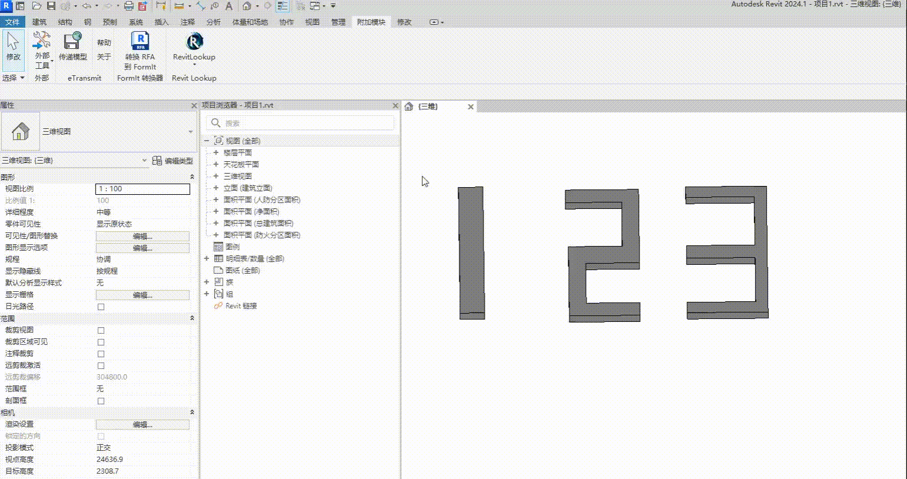

# SequentialSelector

模拟Revit多选功能，但能够按照选择顺序返回所选元素。

参考：[OptionsBar](https://github.com/atomatiq/OptionsBar)

TODO

- [ ] 支持 Revit 2018 版本，`DialogBarControl` 到 2019 版本才有
- [x] 多选及退出多选
- [x] 模拟选中效果
- [ ] 代码规范化，打包为工具类

效果

